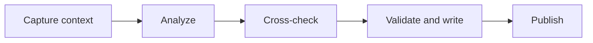

# Diffhound

**Self-hosted pull request review with repository context, peer cross-checks, and persistent finding history.**

Diffhound turns a pull request into a structured GitHub review: actionable findings, inline comments, a scorecard, and a verification checklist. It follows findings across new commits, checks proposed issues against repository evidence, and publishes through the GitHub account you configure.

Run it from the CLI, Docker, GitHub Actions, or a shared review server. This README describes the current `main` branch; older tags may have different behavior.

[Quick start](#quick-start) · [Review pipeline](#review-pipeline) · [Configuration](#configuration) · [Automation](#automation) · [Operations](#operations)

## Capabilities

| Capability | What it provides |
| --- | --- |
| Context-aware review | Changed code, enclosing functions, callers, related types, sibling files, Git history, and earlier review comments, within context budgets. |
| Peer cross-checks | A Claude Sonnet adversarial pass and a Gemini pass, with actual peer coverage reported in the review. |
| Large-PR support | Size-based routing, file triage, parallel review chunks, shared cross-file context, and a Git fallback for oversized GitHub patches. |
| Review continuity | Ancestry-aware re-reviews, finding deduplication, reopened/escalated findings, and one persistent PR summary. |
| Controlled publication | Bounded review bodies, complete-output validation, stale-head checks, and per-PR locks on a shared host. |
| Reviewer voice | Comment rewriting guided by examples and feedback from earlier reviews. |
| Explicit PR commands | Questions, descriptions, labels, and changelog entries, with CLI previews before applying changes. |
| Advisory design review | A separate UX review of changed UI files and available PR screenshots, when the runtime budget permits. |

Reviews focus on correctness, security, reliability, performance, and test gaps. Findings and model agreement are evidence to assess; they do not replace human review or running the project's tests.

## Quick start

### Requirements

- Linux or macOS with Bash, Git, Python 3.9+, curl, jq, GNU awk, and GNU coreutils.
- An authenticated [GitHub CLI](https://github.com/cli/cli), with repository access and permission to publish reviews and comments.
- An exported, funded `ANTHROPIC_API_KEY` for the configured Anthropic backend.
- An installed and authenticated [Gemini CLI](https://github.com/google-gemini/gemini-cli) for both peer slots to be available. Without it, the review reports reduced peer coverage.

The current review pipeline calls Anthropic directly. Claude Code and Codex CLI are not required for its primary, peer, or formatting stages.

On macOS:

```bash
brew install coreutils gawk jq gh
# Make both timeout and gtimeout available to the pipeline.
export PATH="$(brew --prefix coreutils)/libexec/gnubin:$PATH"
```

On Debian/Ubuntu, with the GitHub CLI package source available:

```bash
sudo apt-get update
sudo apt-get install bash git python3 curl jq gawk coreutils gh
```

### Install and review

```bash
mkdir -p "$HOME/.local/share"
git clone https://github.com/shubhamattri/diffhound.git "$HOME/.local/share/diffhound"
export PATH="$HOME/.local/share/diffhound/bin:$PATH"

gh auth login
gh auth setup-git

# Export ANTHROPIC_API_KEY from your secret manager or shell environment first.
# Generate a review; publication asks for confirmation.
diffhound 123 --repo owner/repo
```

Persist the PATH setting in your shell configuration. `--repo` creates or reuses a checkout under `~/repos/owner/repo` and derives the reviewer login from `gh`. To use an existing checkout, set `REVIEW_REPO_PATH` and `REVIEW_LOGIN` instead.

```bash
# Publish without the interactive confirmation step.
diffhound 123 --repo owner/repo --auto-post

# Use fast mode for a follow-up review.
diffhound 123 --repo owner/repo --fast

# Re-examine the full PR, including previously reviewed files.
diffhound 123 --repo owner/repo --force-full

# Process feedback from edited/deleted comments and developer replies.
diffhound 123 --repo owner/repo --learn

# Run only the advisory UI design check.
diffhound 123 --repo owner/repo --design-only
```

**Fast mode still runs peer review.** When an incremental diff is available, the peer prompts focus on it. A large PR may still require full-context chunk analysis. `--force-full` ignores the previous review baseline while retaining existing threads as context.

`--learn` can update learned state and post thread replies; it is not a preview mode.

## Review pipeline



| Stage | Current implementation |
| --- | --- |
| Prepare | Acquire a host-local PR lock, fetch metadata/history, and materialize the PR head in an isolated worktree. |
| Retrieve | Assemble bounded code context, static-analysis evidence, and any configured repository guidance. |
| Analyze | Claude Opus (`claude-opus-5`) reviews the supplied evidence. Large diffs use parallel chunks with shared PR context. |
| Cross-check | Claude Sonnet (`claude-sonnet-5`) challenges findings; Gemini runs in parallel through its CLI. |
| Verify and write | Validators and model verification filter findings; Sonnet prepares the final review in the configured voice. Haiku supports triage, chunk merging, and deduplication. |
| Publish | Reconcile finding history, validate the body budget and current head, then submit the review and update the persistent summary. |

The primary Anthropic request receives prepared code context; it does not have repository-browsing tools. Tree-sitter can improve enclosing-function extraction, with a line-window fallback when unavailable. Gemini's 14 KB prompt reserves separate space for instructions, findings, the actual diff and repository context. Peer completion counts usable responses, not correctness or exhaustive PR coverage.

Before wording, every primary and peer candidate goes through a shared repository evidence gate. It reads immutable source at the captured head, including callers, settings, tests and nearby lifecycle code. Verification requests use a native JSON schema contract; local checks still require every decision to cover its candidate and cite supplied source lines. The gate retains supported findings, corrects overstated claims, removes contradicted or non-actionable claims and withholds unverified candidates. It can restore copied indentation at the exact source coordinate, or repair a line number when the unchanged quote has one match in the supplied file; it never guesses both. Invalid citations withhold the affected decision and appear in the uncertainty count, preserving valid neighboring findings. Missing decisions, malformed responses and incomplete generation still stop publication. A review with unverified candidates cannot approve the PR. Quoted objections in peer prose remain context for verification, not new finding records.

The gate receives the configured voice examples and produces the final comment text. Final rendering rebuilds the complete finding list from the checked locations, severities and verbatim bodies, and builds summary claims from the same set. Numeric category scores remain advisory. Proposed thread replies from the formatting pass are withheld because they have not passed this evidence gate; separate reply-command handling is unchanged. Source-checked runs submit a new review rather than refreshing older unchecked finding text into the current head's body. Historical findings remain linked, not silently marked fixed.

Review instructions explicitly cover program comprehension, architectural fit, compatible reuse, dead code, duplication, unnecessary abstractions, misleading comments and ineffective tests. These are evidence checks, not a judgement about who or what wrote the code. Text search cannot establish complete reachability, and a source quote cannot establish that a model's reasoning is correct. Tests are never claimed as executed merely because their source was read. See [the design and limits](docs/SYSTEM_REVIEW.md).

### Large diffs and output limits

When GitHub refuses a patch above its 20,000-line limit, Diffhound builds the full three-dot diff from the base and head commits captured in PR metadata. It fetches missing commits and complete ancestry for shallow clones. Unrelated API failures and missing history remain errors.

Diff acquisition and model input have different budgets. Generated files, lockfiles, configured exclusions, context limits, and size-based routing affect what reaches the models. Deleted guards and other deletion-only hunks are retained by the active review path.

| Budget | Default |
| --- | --- |
| Primary, Sonnet peer, and voice output | Up to 128,000 tokens per call |
| Repository evidence gate | Up to 128,000 output tokens per batch of 8 candidates, up to 4 concurrent calls; 900 seconds per call, limited by the remaining 1,200-second stage budget; every located candidate must receive a decision |
| Haiku chunk-merge output | Up to 64,000 tokens per call |
| Primary, Sonnet peer, and voice call timeout | 900 seconds |
| Chunk-merge call timeout | 600 seconds |
| Final review body | 150,000 UTF-8 bytes, including embedded history and markers |

Token ceilings are maximums, not target lengths. Large full reviews can exceed 25 minutes; allow 60 minutes at the job level and configure the executor's own process deadline and cleanup. Raising an Actions timeout alone does not configure the remote server.

The final voice response must finish with `end_turn` and contain complete comment/summary sections, a scorecard, verdict, and checklist. A failed validation gets one further attempt. Incomplete output or a body that cannot fit is rejected before publication, rather than silently trimmed.

### Re-reviews and finding history

- Use a previous reviewed commit as the incremental baseline when ancestry is valid; fall back to the full PR when it is not.
- Keep the full diff available for cross-file context. Large re-reviews may still analyze all chunks while focusing feedback on changes.
- Reconcile findings by full path and concern. Deterministic matching handles exact repeats; a model judge can link reworded, nonblocking findings.
- Use explicit thread-resolution evidence. A nearby edit or a finding's absence from the next review does not close it; recurrence and severity increases can reopen or escalate it.
- Put inline overflow into the review body and preserve it in finding history. Source-checked rounds link prior reviews and keep current assertions within the checked finding set.

History v2 stores changed finding records in submitted review bodies and links earlier rounds. Fresh workers can reconstruct state from GitHub without a separate database. Unreadable history stops publication; unavailable thread status retains findings. Once v2 history exists, rollback requires a v2-aware build.

## Configuration

### Runtime settings

| Variable | Default / requirement | Purpose |
| --- | --- | --- |
| `ANTHROPIC_API_KEY` | Required | Funded API credential for Anthropic model calls. |
| `GH_TOKEN` | Existing `gh` authentication | GitHub identity and permissions used by the process. |
| `REVIEW_REPO_PATH` | Required without `--repo` | Existing local repository checkout. |
| `REVIEW_LOGIN` | Derived with `--repo`; otherwise required | Reviewer identity for history and publication. |
| `ANTHROPIC_API_URL` | Anthropic Messages endpoint | Backend override; the API credential is sent to this endpoint. |
| `DIFFHOUND_REQUIRE_HEAD` | `0` | Set to `1` to abort if the PR-head worktree cannot be materialized. Recommended for automation. |
| `DIFFHOUND_MAX_INLINE` | `8` | Initial-review nonblocking inline limit. Blockers are uncapped; overflow goes into the body. |
| `DIFFHOUND_MAX_INLINE_REREVIEW` | `3` | Nonblocking inline limit for subsequent reviews. |
| `DIFFHOUND_MAX_REPLIES` | `3` | Thread-reply limit; overflow goes into the body. |
| `DIFFHOUND_MAX_BODY_CHARS` | `150000` | Legacy variable name; the budget is **UTF-8 bytes**, allowed range 1–150000. |
| `DIFFHOUND_LOCK_DIR` | `~/.cache/diffhound/locks` | Shared directory for per-PR locks on one host. |
| `REVIEW_RAG_SCRIPT` | Bundled `lib/rag.sh` | Override the code-context retriever. |
| `DIFFHOUND_DEDUP_MODEL` | `claude-haiku-4-5-20251001` | Judge for reworded nonblocking findings. |
| `DIFFHOUND_COMMAND_MODEL` | `claude-sonnet-5` | Model used by explicit PR commands. |
| `DIFFHOUND_SKIP_PEER` | `0` | Explicit opt-out from peer review. |
| `DIFFHOUND_DESIGN` | `1` | Set to `0` to disable the advisory design check. |
| `DIFFHOUND_OFFLINE` | `0` | Test mode for model-calling validators; explicit commands are disabled. |

Review invocations load `~/.profile`; explicit commands require their environment to be exported by the caller. The model backend does not use `CLAUDE_CODE_OAUTH_TOKEN`.

The runtime sets `DIFFHOUND_SOURCE_CHECK_ENABLED=1` internally when it owns the final evidence gate. Older running processes retain their legacy verifier during an upgrade; this handshake is not a user configuration option.

The evidence gate withholds and counts legacy notes that lack an unambiguous source location. It runs at most four bounded verification calls together; malformed provider decisions still stop publication.

### Repository guidance and voice

Place `.diffhound.yml` or `.diffhound.yaml` in the reviewed repository. YAML configuration requires PyYAML or a compatible `yq` installation. A `.diffhound.md` file can supply plain-text context when no YAML configuration is present.

```yaml
review:
  priorities:
    - Authentication and authorization boundaries
    - Data integrity and failure recovery
  skip_files:
    - "docs/generated/**"
  context: |
    Background jobs must tolerate duplicate delivery.
    User-visible errors must not expose sensitive data.
```

Voice examples live at `~/.diffhound/voice-examples.jsonl`. Add representative comments with `category`, `subcategory`, `file_type`, and `comment` fields. Posted comments and `--learn` feedback help maintain those examples. See [Customization](docs/CUSTOMIZATION.md).

## Explicit PR commands

```bash
diffhound /ask 123 --repo owner/repo --question 'What changes in the authorization flow?'
diffhound /describe 123 --repo owner/repo
diffhound /labels 123 --repo owner/repo
diffhound /changelog 123 --repo owner/repo

# Generate from current evidence and apply in the same invocation.
diffhound /describe 123 --repo owner/repo --apply
```

CLI commands preview JSON by default, including the reviewed SHA and application status. Each makes one generation call. `/describe` and `/changelog` maintain separate marked sections of the PR description while preserving human text; `/changelog` does not edit a repository file. Labels are additive and must already exist.

`--apply` regenerates the result; it does not submit a saved preview. Invalid/truncated output and a changed head prevent writes. Commands have a separate 200,000-character diff ceiling and use GitHub's diff endpoint; they do not use the review pipeline's oversized-patch Git fallback.

In the comment-triggered workflow, an explicit command from a repository writer applies immediately. Bots and readers cannot trigger it. `/ask` maintains one answer per triggering comment, or one CLI answer per PR.

## Automation

| Option | Setup |
| --- | --- |
| Shared review server | Run `bin/diffhound` with the server's authenticated GitHub/model environment. Schedule the fallback sweep if required. |
| Reusable GitHub workflows | Copy the [consumer workflow](examples/diffhound-workflow.yml). Reviews run on the SSH server; explicit commands run on GitHub-hosted runners. |
| Docker Action | Use [action.yml](action.yml) with `pr-number`, `mode`, `auto-post`, and optionally `repo-path`. Commands also accept `command`, `question`, and `apply`. |
| Direct Docker | Build the image below or use an appropriate published tag from the [container package](https://github.com/shubhamattri/diffhound/pkgs/container/diffhound). |

The reusable review workflow expects `DIFFHOUND_HOST` and `DIFFHOUND_SSH_KEY`, with Diffhound installed at `/home/ubuntu/diffhound` for the `ubuntu` user. Configure GitHub access, the funded API key, and Gemini on that server. The command workflow separately requires `DIFFHOUND_GITHUB_TOKEN` and `ANTHROPIC_API_KEY` repository secrets.

For the Docker Action and direct Docker, pass `GH_TOKEN` and `ANTHROPIC_API_KEY` through the environment. The token's account is the publishing identity; use the existing reviewer's token when that identity matters. Configure Gemini credentials for the container separately if both peer slots are required.

```bash
docker build -t diffhound:local .
docker run --rm -e GH_TOKEN -e ANTHROPIC_API_KEY diffhound:local \
  /describe 123 --repo owner/repo
docker run --rm -e GH_TOKEN -e ANTHROPIC_API_KEY diffhound:local \
  123 --repo owner/repo --auto-post
```

Keep `synchronize` enabled to review new commits. Host-local locks serialize workflow and sweep reviews only when they share the same lock directory. Use a shared review executor for each repository, or provide external coordination across independent hosts.

### Fallback sweep

`bin/diffhound-sweep` polls configured repositories for unreviewed PR heads independently of Actions. It checks submitted GitHub reviews as well as local state, applies a grace window, and retries a failed head up to three times by default. After those attempts, a new commit or an operator reset is needed. See [Sweep setup and operations](docs/SWEEP.md).

The sweep stops starting new reviews after `DIFFHOUND_SWEEP_CYCLE_BUDGET_SECONDS` (default 900). Each invocation has `DIFFHOUND_SWEEP_REVIEW_TIMEOUT_SECONDS` (default 3,300), including lock waiting, plus a 60-second termination grace. Use the supplied 75-minute systemd timeout and control-group cleanup with these defaults; an older 30-minute service timeout can terminate a healthy invocation early. Cron needs equivalent supervision to clean up nested process groups. GitHub metadata reads are bounded to 30 seconds and failures do not consume review attempts.

## Operations

### Evidence and troubleshooting

Run artifacts are stored under `~/.diffhound/logs/<owner-repo>/pr-<number>/<timestamp>-<sha>/`. Available artifacts include chunk outputs and stop reasons, validator actions, peer responses, voice prompts/output, the summary, a run manifest, and token/cost reports. The pipeline prunes archives older than 30 days.

| Symptom | First check |
| --- | --- |
| API preflight refuses auto-post | Verify the configured endpoint, key, provider quota, and billing. The preflight tests whether the backend answers. |
| Large patch cannot be fetched | Inspect the Git fallback error, origin access, pinned commits, and available ancestry. |
| No fresh review | Check the latest PR head, Actions events, sweep log, grace window, and per-head attempt count. |
| A run exceeds its time budget | Check both caller and server deadlines, then the current model stage. Increasing only the caller's timeout may leave the server unchanged. |
| Reduced peer coverage | Inspect peer output and Gemini authentication/timeouts. Coverage is reported with the published review. |
| Review generation finishes but publication fails | Check final-output validation, body bytes, current-head checks, history reads, and GitHub permissions. |

An oversized patch, provider quota failure, missing trigger, and held lock require different remedies. Retain the run evidence before retrying. Preserve learned blocklists and runtime configuration during upgrades.

### Data and cost

Self-hosting controls the executor and local state; review content still goes to the configured model providers. Prompts can contain source code, PR descriptions, review history, retrieved context, and design screenshots. Logs can retain the same material. Configure credentials, access, and retention for the repositories being reviewed.

Anthropic calls use a funded API key. `usage.tsv` records returned token usage and `cost.txt` estimates Anthropic spend using the repository's rate table. Gemini usage is reported as a separate call count and is not included in that cost total. Actual cost depends on diff size, context, model output, chunk count, and retries.

## Development and documentation

```bash
# Run from the Diffhound checkout.
DIFFHOUND_OFFLINE=1 bash tests/run.sh
```

The suite includes validator fixtures and standalone tests for history, publication, command handling, locks, watchdog cleanup, voice validation, and oversized Git diffs. Offline tests verify pipeline contracts; live integration checks are needed for credentials, provider availability, and GitHub publication.

| Resource | Contents |
| --- | --- |
| [Architecture](docs/ARCHITECTURE.md) | Pipeline stages, modules, and publication boundaries. |
| [Customization](docs/CUSTOMIZATION.md) | Repository guidance, review voice, and context retrieval. |
| [Sweep](docs/SWEEP.md) | Fallback scheduling, state, and troubleshooting. |
| [Adoption notes](docs/OSS-ADOPTION.md) | Finding-lifecycle and integration mechanisms. |
| [Source history](https://github.com/shubhamattri/diffhound/commits/main/) | Recent changes on `main`. |
| [Changelog](CHANGELOG.md) | Recorded release notes. |

## License

[MIT](LICENSE) · Shubham Attri
